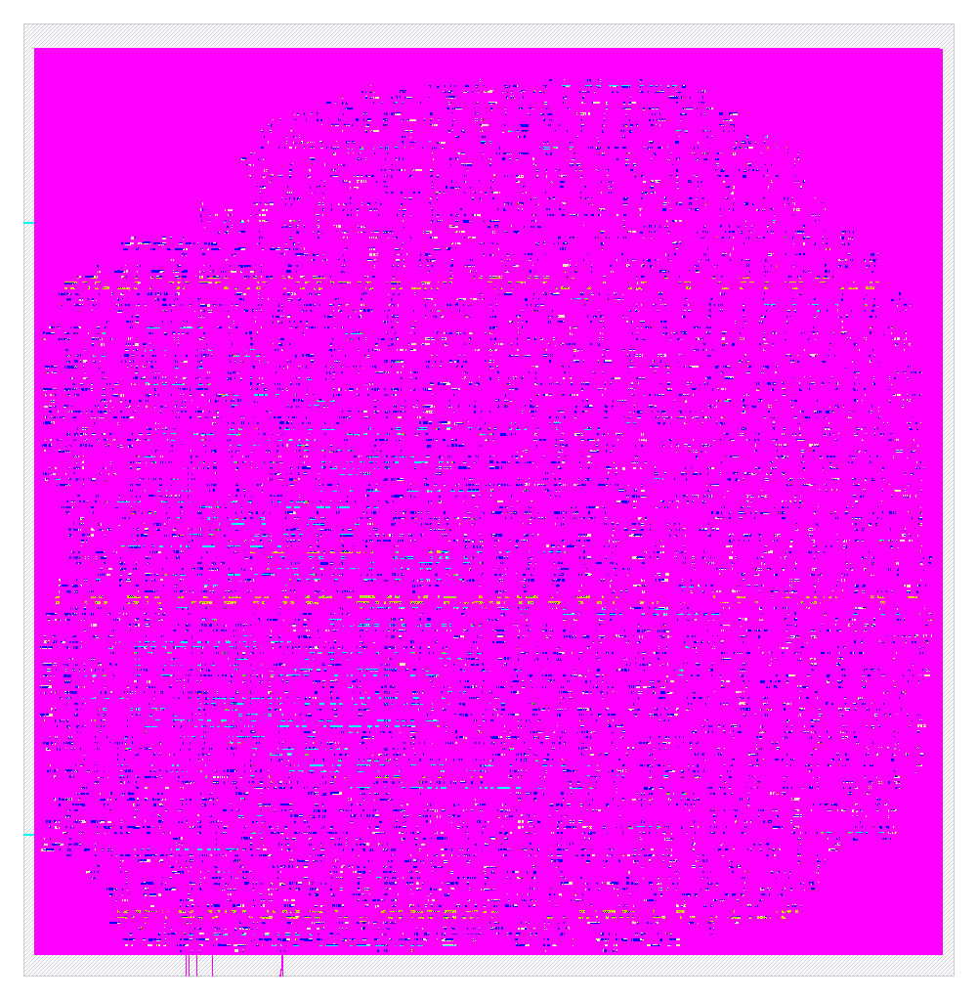

# jev_dot_spi

`jev_dot_spi` is a hardened hard macro for SkyWater SKY130 (`sky130_fd_sc_hd`). This package contains two views:

| File | What it is |
|---|---|
| `lef/jev_dot_spi.lef` | Abstract physical view (LEF 5.7) for place and route |
| `vh/jev_dot_spi.vh` | Verilog blackbox. Its signal ports match `rtl/jev_dot_spi.v` |
| `rtl/jev_dot_spi.v` / `rtl/jev_dot_spi.vhd` | Generated RTL in Verilog and VHDL |
| `rtl/jev_dot_spi_tb.v` / `rtl/jev_dot_spi_tb.vhd` | Self-checking testbenches (16 golden vectors) |
| `gds/jev_dot_spi.gds` | Hardened layout |
| `jev_dot_spi.png` | Picture of that layout |
| `metrics.json` | Signoff metrics for the hardening run |
| `lib/` | Three nominal liberty files: ff at −40 °C 1.95 V, ss at 100 °C 1.60 V, tt at 25 °C 1.80 V |
| `librelane/config.json` | OpenLane config used for the run. Clock period 25 ns |

## Macro summary

| Property | Value |
|---|---|
| Class | `BLOCK` |
| Size | 450.675 µm × 461.395 µm (origin 0, 0) |
| Signal pins | 8 (5 input bits, 3 output bits) |
| Power | `VPWR` and `VGND`, 3 vertical met4 straps each, running y = 10.64 to 449.04 µm, and 3 horizontal met5 straps each |
| Pin layers | met3 on the west edge (2), met2 on the south edge (6) |
| Obstructions | nwell, li1, and met1 cover the core. met2 to met5 are partly blocked; see `OBS` in the LEF |
| Signoff | Corner `max_ss_100C_1v60`. Worst setup slack 2.220 ns. Worst hold slack 0.827 ns. Slew, capacitance, fanout, route DRC, Magic DRC, KLayout DRC, and LVS are 0 |

## Ports

| Port | Dir | Width | Notes |
|---|---|---|---|
| `clk` | in | 1 | Chip clock. The signoff period is 25 ns, which is 40 MHz |
| `rst` | in | 1 | Synchronous reset, active high |
| `spi_sclk` | in | 1 | SPI clock, mode 0. At most one eighth of `clk` (5 MHz at 40 MHz) |
| `spi_cs_n` | in | 1 | Chip select, active low |
| `spi_mosi` | in | 1 | Master out, slave in. MSB first |
| `spi_miso` | out | 1 | Master in, slave out. MSB first |
| `spi_miso_oe` | out | 1 | High while chip select is low, so a shared bus can turn the pad around |
| `irq` | out | 1 | Interrupt. High when interrupt enable is set and a result is waiting |
| `VPWR`, `VGND` | inout | 1 | Only when `USE_POWER_PINS` is defined |



## How it works

This section was traced from the gate netlist in `rtl/jev_dot_spi.v`. The register names in that file are the SPI shifter, the register block, and the same four-pair multiply used by `jev_dot_pipe`.

**Synchronizers.** `spi_sclk`, `spi_cs_n`, and `spi_mosi` are asynchronous to `clk`. Each one passes a flop chain (`sck1` `sck2` `sck3`, `cs1` `cs2` `cs3`, `mo1` `mo2`). Edges are detected on `clk`. That is why `spi_sclk` stays at or below `clk/8`: the synchronizer has to see the edge.

**The frame.** A frame is the time chip select is low. The first byte is the command. Bit 7 is write. Bits 3 to 0 are the register address. While that command byte shifts in, `spi_miso` shifts out a status byte:

| Status bit | Name | Meaning |
|---|---|---|
| 7 | DONE | A result is waiting |
| 6 | BUSY | A started set is still in the engine |
| 5 | WPEND | A write word is still waiting to be accepted |
| 4 | OVF | A write word was dropped since this frame began |

A write frame then sends 32-bit words, MSB first. Each word is written to the current address, and the address then increments. Nine words is the full operand set plus the control word: 1 command byte + 9 × 4 data bytes = 37 bytes. A word is dropped, and OVF sets, when the previous write is still waiting. That happens when the engine is busy, so the status byte is the place to look before writing the next set.

A read frame sends one dummy byte, then the 32 bits of the register. The register is read once per frame. A read of RESULT therefore pops the result once. If the master keeps clocking, those 32 bits repeat.

`spi_miso_oe` is high for the whole time chip select is low. The testbench checks that: chip select high leaves the enable at 0, chip select low leaves it at 1.

**The registers.** Addresses are 4 bits.

| Address | Name | What a read or write does |
|---|---|---|
| 0 to 3 | `X0` to `X3` | The four words that will be multiplied |
| 4 to 7 | `W0` to `W3` | The four words they are multiplied by |
| 8 | CTRL / STATUS | Write bit 0 starts the engine with the words above. Write bit 1 sets the interrupt enable. Read bit 0 is BUSY, bit 1 is DONE, bit 2 is the interrupt enable |
| 9 | RESULT | Read the 32-bit sum. The read pops it and clears DONE |
| 15 | ID | Read-only constant `0x4A455644`. That constant is `k_342` in `rtl/jev_dot_spi.v` |
| other | | A read returns 0 |

**The dot product.** Once started, the engine is the `jev_dot_pipe` multiply. A 2-bit state walks the four pairs, one product per clock, and adds them in 32 bits. `irq` is high when the interrupt enable is set and DONE is set.

## RTL

The RTL comes from the WASMApollo EDA (heapvm vgpu apollo), generated from the typed fabric `jev_dot_spi`. The Verilog and VHDL are the same design.

| Property | Value |
|---|---|
| LUT4 cells | 252 |
| Word PEs | 112 |
| Registers | 63 |
| Combinational depth | 11 levels |
| Clocking | Single `clk`. Every register latches on the rising edge from the settled levels |
| Reset | `rst` is synchronous, active high, and loads the fabric's initial state |

### Microcode ROMs

The multiply uses the same three controller ROMs as `jev_dot_pipe`. Each maps a controller state to a select code (LSB first).

- `route_x`: state 0 selects `x0` (code `00`), state 1 selects `x1` (`01`), state 2 selects `x2` (`10`), state 3 selects `x3` (`11`).
- `route_w`: the same four states select `w0`, `w1`, `w2`, `w3`.
- `mac_op`: states 0 to 3 all select `mac` (code `1`).

## Simulation

Both testbenches are self-checking. Each vector holds `rst` for one cycle, runs 16 cycles, and then compares `spi_miso`, `spi_miso_oe`, and `irq` against the fabric's golden model (RefSim).

```sh
# Verilog (Icarus), from rtl/
iverilog -o tb jev_dot_spi.v jev_dot_spi_tb.v && vvp tb
# expected: PASS jev_dot_spi: 16 vectors

# VHDL (GHDL), from rtl/
ghdl -a jev_dot_spi.vhd jev_dot_spi_tb.vhd && ghdl -e jev_dot_spi_tb && ghdl -r jev_dot_spi_tb
```

The VHDL testbench was run with GHDL and passes all 16 vectors. The Icarus command above is the Verilog run.

## Using the macro

### In RTL

```verilog
`include "jev_dot_spi.vh"

jev_dot_spi u_spi (
`ifdef USE_POWER_PINS
  .VPWR(vccd1),
  .VGND(vssd1),
`endif
  .clk(clk), .rst(rst),
  .spi_sclk(spi_sclk), .spi_cs_n(spi_cs_n), .spi_mosi(spi_mosi),
  .spi_miso(spi_miso), .spi_miso_oe(spi_miso_oe), .irq(irq)
);
```

The blackbox file in this package is `vh/jev_dot_spi.vh`. Define `USE_POWER_PINS` for power-aware simulation and LVS. Leave it undefined for plain RTL simulation.

### In OpenLane / OpenROAD

Add the LEF, the GDS, and the blackbox to your top-level config, for example:

```json
"EXTRA_LEFS": ["dir::lef/jev_dot_spi.lef"],
"EXTRA_GDS_FILES": ["dir::gds/jev_dot_spi.gds"],
"VERILOG_FILES_BLACKBOX": ["dir::vh/jev_dot_spi.vh"]
```

Then connect `VPWR` and `VGND` to the power grid through the met4 and met5 straps. The GDS in this package is `gds/jev_dot_spi.gds`.

## Other PDKs

The `VPWR`/`VGND` names belong to the hardened SKY130 view. To target another public PDK, synthesize `rtl/jev_dot_spi.v` there and use that PDK's supply names. The LEF only applies to SKY130.
